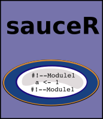

<!-- README.md is generated from README.Rmd. Please edit that file -->


Overview
--------

sauceR is a small package providing additional functionality to the **source()** function in {base}. Specifically, a source file can be internally marked-up into modules, and the the modules can be individually executed.

Installation
------------

``` r
# This package is not available on CRAN

# Install the development version from GitHub
# install.packages("devtools")
devtools::install_github("dreidpath/sauceR")
```

Usage
-----

`library(sauceR)` will load the package.

Packages
--------
